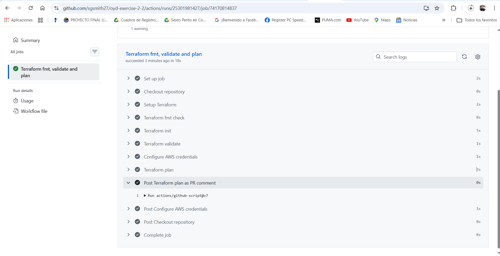

# Exercise 2.2 — Terraform CI with GitHub Actions

Curso: Optimizaciones y Desempeño — Cloud Deployment Automation

---

# Objetivo

Automatizar la validación de Terraform mediante un pipeline CI en GitHub Actions que:

- valida formato
- inicializa Terraform
- valida configuración
- genera plan
- publica el plan como comentario en el Pull Request

---

# Tecnologías utilizadas

- Terraform
- AWS
- GitHub Actions
- YAML

---

# Workflow

El pipeline se ejecuta automáticamente en Pull Requests hacia `main`.

Pasos:

1. terraform fmt --check -recursive  
2. terraform init -backend=false  
3. terraform validate  
4. terraform plan  
5. Publicación del plan en el PR  

---

# Evidence

## Pull Request

https://github.com/sgsmith27/oyd-exercise-2-2/pull/1

## Screenshot del comentario

---

# Conceptos aplicados

- Continuous Integration (CI)
- GitHub Actions workflows
- Terraform automation
- PR validation
- Secrets management
- Infrastructure as Code

---

# Autor

Sergio Geovany García Smith
Carnet: 25008130
